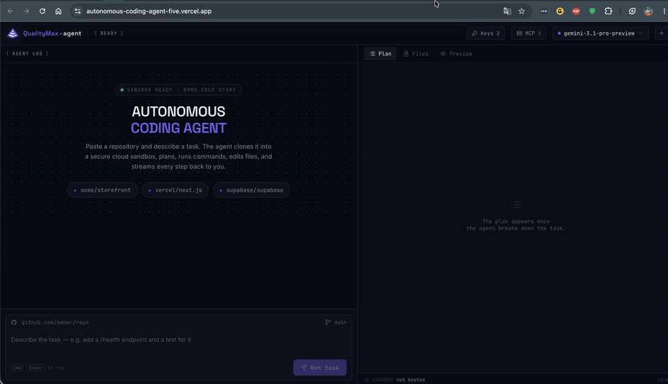

# Autonomous Coding Agent

An autonomous coding agent that clones a repository, plans a task, and implements it inside an isolated cloud sandbox — with a streaming Next.js frontend that shows every command, file edit, and thought in real time.

Think Codex, Jules, or Devin: give it a repo URL and a task description, watch it work.

## Demo

<!-- TODO: add a recording of a real run (clone → plan → run commands → edit → preview).
     Drop a GIF or MP4 at docs/demo.gif and reference it here, e.g.:
      -->

_A recorded walkthrough is coming. In the meantime, run it yourself in under a minute with the [live demo](#live-demo-bring-your-own-key) (bring your own keys) or the [quick start](#quick-start)._

## Features

- **Bring your own key (BYOK)** — enter your own E2B + LLM keys in the UI (stored only in your browser); a public deployment runs entirely on the visitor's own credentials, with no server-side secrets

- **Autonomous coding** — clones repos, installs packages, runs commands, reads and writes files
- **Task planning** — the agent records a step-by-step plan up front (`update_plan`) and keeps it live as it works; the Plan tab shows each step's status with a progress bar
- **Fast Apply** — applies targeted code edits by regenerating only the changed region (à la Cursor)
- **Multi-provider LLM** — Anthropic (Claude Opus 4.8), OpenAI (GPT-5), Google (Gemini 3); switch per-session from the UI
- **Streaming UI** — every tool call (command + output, file contents, diffs) streams in real time
- **MCP integration** — connect any MCP server from the UI; Linear is pre-configured via env var
- **Live preview** — `expose_port` surfaces a public URL for any server the agent starts, shown in an embedded iframe
- **Live desktop preview (noVNC)** — click **Desktop** in the preview pane to open the running app in a real Chrome browser, streamed over noVNC from a **separate** desktop sandbox (the coding sandbox is untouched). User-initiated and spun up on demand; torn down with the session
- **Workspace panel** — Plan / Files / Preview tabs: follow the plan, browse and view every file the agent touched, and switch the preview between the page iframe and the live desktop stream

## Prerequisites

- Node.js 18+
- An [E2B API key](https://e2b.dev/docs/getting-started/api-key)
- At least one LLM API key (Anthropic, OpenAI, or Google)

## Quick start

```bash
git clone <this-repo>
cd autonomous-coding-agent
npm install
```

Copy `.env.example` to `.env.local` and fill in your keys (`.env.local` is gitignored):

```env
# Required
E2B_API_KEY=your_e2b_api_key

# At least one of these
ANTHROPIC_API_KEY=your_anthropic_key
OPENAI_API_KEY=your_openai_key
GOOGLE_GENERATIVE_AI_API_KEY=your_google_key

# Optional — Linear MCP (pre-configured tool in the agent)
LINEAR_API_KEY=your_linear_key

# Optional — override default models
ANTHROPIC_MODEL=claude-opus-4-8
OPENAI_MODEL=gpt-5
GOOGLE_MODEL=gemini-3.1-pro-preview

# Optional — set provider priority order (first available wins)
ROUTER_ORDER=anthropic,openai,google

# Optional — additional MCP servers as JSON
# MCP_SERVERS=[{"name":"my-server","url":"https://...","authToken":"..."}]
```

Start the dev server:

```bash
npm run dev
```

Open [http://localhost:3000](http://localhost:3000).

## Usage

1. **Choose a model** — click the provider/model selector in the top-right header
2. **Enter a repo URL** — any public GitHub repo (e.g. `https://github.com/vercel/next.js`)
3. **Describe a task** — e.g. "Add a /health endpoint that returns `{status: ok}` and a test for it"
4. **Click Run** — the agent streams its plan, commands, and file edits in the left panel
5. **Follow the plan** — the **Plan** tab shows the agent's step-by-step breakdown and live progress
6. **Inspect files** — the **Files** tab shows every file the agent touched; click to view/edit
7. **Live preview** — if the agent starts a server, the **Preview** tab shows it in an iframe automatically. Click **Desktop** to instead watch a real Chrome browser render the app, streamed live over noVNC (spins up a separate desktop sandbox on demand)

### Adding MCP servers

Click the plug icon in the header → enter a name, URL, and optional auth token. The server's tools are merged into the agent's tool set for the session.

### Stopping mid-run

Click the **Stop** button to abort the current agent run. Stopping (and starting a new session) tears down every sandbox for the session — both the coding sandbox and any desktop-preview sandbox — so nothing is left running. Idle sandboxes are also auto-cleaned after 10 minutes.

## Architecture

```
app/
  page.tsx              # Main UI — chat log + workspace panel
  api/agent/route.ts    # Streaming agent endpoint (Vercel AI SDK)
  api/preview/route.ts  # User-initiated desktop preview: POST spins one up, DELETE tears sandboxes down
lib/
  sandbox.ts            # Coding-sandbox pool (session-scoped, 10-min idle timeout)
  tools.ts              # Agent tool definitions (update_plan, run_command, read/write_file, apply_edit, expose_port)
  preview.ts            # Dedicated desktop (noVNC) sandbox lifecycle — driven by the user, not the agent
  fastApply.ts          # Fast Apply — AI-assisted targeted file edits
  mcp.ts                # MCP client factory (built-in Linear + user-configured servers)
  router.ts             # Multi-provider LLM router with automatic fallback
components/
  AgentLog.tsx          # Streaming message + tool call renderer
  ToolCallCard.tsx      # Per-tool-call expandable card
  Workspace.tsx         # Plan / Files / Preview tabs (file viewer + browser & noVNC previews)
  Header.tsx            # Model selector, MCP config, new-session button
  Composer.tsx          # Repo URL + task input
```

The agent runs inside a cloud sandbox: a real Linux VM with a full filesystem, shell, and internet access. Each browser session gets its own sandbox; idle sandboxes are cleaned up after 10 minutes.

## Tests

```bash
npm test            # run the suite once (Vitest)
npm run test:watch  # watch mode
```

The suite is deterministic and needs no credentials:

- **Security validators** — exhaustive coverage of the live-preview URL guard (`assertSafeHttpUrl`): allows public hosts; rejects non-http(s) schemes, loopback/private/cloud-metadata hosts, IPv6 literals, the IP-notation SSRF bypasses (octal/hex/decimal), and trailing-dot tricks — plus `shellQuote` (command-injection guard).
- **Route contract** — `POST`/`DELETE /api/preview` behaviour (success, 400 validation, 502 boot/validation failure, full teardown) with the sandbox layer mocked.
- **Live sandbox smoke test** — an opt-in end-to-end (`lib/preview.e2e.test.ts`) that boots a real desktop sandbox, asserts the noVNC URL, and tears it down. It runs only when `E2B_API_KEY` is set, so CI stays deterministic.

## Live demo (bring your own key)

This app is **BYOK**: every API call can carry the visitor's own keys, supplied through the
**Keys** panel in the header (E2B + at least one LLM provider). They're stored only in the
visitor's browser (`localStorage`) and sent with each request — never persisted or logged on
the server. The server falls back to its own env vars when present.

That makes it safe to host a public demo with **no server-side secrets at all**: deploy it
with an empty environment, and each visitor runs the agent on their own E2B + LLM credentials
(so they pay for their own sandbox + token usage, and there's no shared key to drain or abuse).
When the server has no keys configured, the empty state nudges visitors to add their own.

> Why not a fully open, keys-included demo? Each run spins up a real cloud sandbox (arbitrary
> code execution) and makes paid LLM calls — an open instance with shared keys is a cost and
> abuse magnet. BYOK keeps the demo genuinely interactive without that exposure.

## Deploy to Vercel

```bash
npx vercel
```

For a **public BYOK demo**, you can deploy with an empty environment — visitors supply their
own keys in the UI. To run on your own credentials instead, set the environment variables
above in the Vercel project settings. The app has no database — all state is in-memory per
request or client-side.

## Tech stack

- [Next.js 16](https://nextjs.org) (App Router)
- [Vercel AI SDK v6](https://sdk.vercel.ai) — streaming, tool use, multi-provider
- [E2B JavaScript SDK](https://e2b.dev/docs/sdk/js) — cloud sandbox execution
- [Tailwind CSS v4](https://tailwindcss.com)
- TypeScript

## Contributing

Contributions are welcome — see [CONTRIBUTING.md](CONTRIBUTING.md) for setup and
the pre-PR checks. To report a security issue, follow [SECURITY.md](SECURITY.md)
rather than opening a public issue.

## License

[MIT](LICENSE) © QualityMax (Ruslan Strazhnyk)
